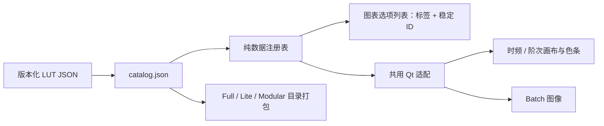

# 热图色表维护

时频图和时间–阶次图默认使用 `tracelab.head-style.v1`（HEAD 风格）。已有项目、View 或 Batch 配方显式选择的色表继续有效；没有记录色表的旧状态使用新默认。未知 ID 临时显示为 gnuplot2 并记录警告，保留原请求以便恢复。

色表定义相对位置 `t∈[0,1]` 的颜色。10～40、20～50、0～50 dB 都使用同一份颜色数据；上下限、自动范围和参考值由既有色阶模块管理。换色表不重新计算谱数据。

## 文件与接线

| 文件 | 职责 |
| --- | --- |
| `mf4_analyzer/colormaps/resources/catalog.json` | 唯一登记入口、显示顺序、稳定 ID、显示名、provider、LUT 路径及 RGB 哈希 |
| `mf4_analyzer/colormaps/resources/luts/<style>-v1.json` | 已发布的完整 256×3 sRGB / uint8 数据与来源等级 |
| `mf4_analyzer/colormaps/registry.py` | 无 Qt 的读取、严格校验和不可变缓存 |
| `mf4_analyzer/qt_analysis_shared.py` | 共用 Qt ColorMap 适配；GUI 和 Batch 同源 |
| `docs/analyzer/colormaps/<style>-v1/provenance.md` | 采样、拟合、端点处理、匹配等级和复核记录 |
| `tools/validate_heatmap_colormaps.py` | 全目录校验，包括漏登记、路径、结构和哈希 |
| `tools/preview_heatmap_colormaps.py` | 从正式资源生成独立 HTML，用于审查全部过渡 |



## 新增一种风格

1. 确定未使用的 ID，例如 `tracelab.cool-warm.v1`。按现有 HEAD JSON 格式准备 256×3 RGB，写明 `evidence_level` 和 `source_note`。不要给文件写入固定 dB 上下限。
2. 添加 `resources/luts/cool-warm-v1.json`，并在 catalog 的末尾添加一条 `provider: rgb_lut` 记录。`file` 使用相对 `luts/...json` 路径；显示名可修改，ID 不能随显示名改变。
3. 计算按行展开的 **768 个 RGB 字节**的 SHA-256，填写 `rgb_sha256`，不是整个 JSON 文件的哈希。例如在项目根目录执行：

   ```bash
   .venv/bin/python -c 'import hashlib,json,pathlib; d=json.loads(pathlib.Path("mf4_analyzer/colormaps/resources/luts/cool-warm-v1.json").read_text()); print(hashlib.sha256(bytes(v for row in d["rgb"] for v in row)).hexdigest())'
   ```

4. 写 `docs/analyzer/colormaps/cool-warm-v1/provenance.md`；有截图采样/拟合时保存 `source-rgb.csv`。来源等级只允许 `original_design`、`screenshot_approximation`、`reference_lut_verified`、`reference_render_verified`，后两者需要相应证据。
5. 校验并生成预览：

   ```bash
   .venv/bin/python tools/validate_heatmap_colormaps.py --print-hashes
   .venv/bin/python tools/preview_heatmap_colormaps.py --id tracelab.cool-warm.v1 --output .state/colormaps/cool-warm-v1.html
   ```

   校验失败返回非零；工具不会修改清单。`--print-hashes` 打印通过校验的哈希。哈希不匹配的诊断也包含实际值，应核实源数据后修订登记。
6. 重启软件后列表自动出现新风格。相同格式的新增色表无需改对话框、两种画布、Batch 或打包脚本。运行以下数据/接线门禁，再检查真实 Qt 画面及对应发布包：

   ```bash
   TMPDIR=/tmp MPLCONFIGDIR=/tmp QT_QPA_PLATFORM=offscreen PYTHONPATH=. .venv/bin/python -m pytest tests/test_heatmap_colormap_registry.py tests/test_heatmap_colormap_extension.py tests/test_heatmap_colormap_preview.py tests/test_batch_render_qt_heatmap.py tests/ui/test_colormap_parity.py tests/ui/test_heatmap_colormap_wiring.py tests/ui/test_custom_colormap_pixels.py -q
   ```

首次整合或改变接线时，还需执行 [实施计划](../plans/2026-10-08-custom-heatmap-colormaps-plan.md) 中的状态、导入和打包门禁。只新增数据不需要泛跑全部 UI 测试。

## 版本与默认值

- 已发布 `v1` 的 RGB 不可原位替换；改变过渡或端点必须新增 `v2`，保留旧版本，以确保旧项目可重现。校验器只能证明当前文件与当前清单相符；发布审核还须比较上次发布的 ID/哈希。
- 默认值只在 `registry.py:DEFAULT_HEATMAP_CMAP` 定义。新增色表不会自动切换默认。
- 缺失或损坏的已登记资源直接报错，不能伪装成正常 fallback。未知外部 ID 的兼容显示与资源损坏是不同问题。
- 作者资料不随应用打包；正式 `resources` 整目录由三种 Windows 配置收集。应用不读取 HTML 或截图来生成色表。

当前 HEAD 的来源见 [provenance.md](head-style-v1/provenance.md)，实际验收见 [实施记录](../verify/2026-10-08-custom-heatmap-colormaps-verification.md)。
