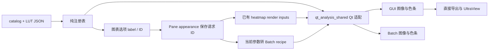

# 自制热图色表管理与接入计划

日期：2026-10-08

状态：源码实施完成，HEAD 风格已设为默认；分层验收结果见 [实施记录](../verify/2026-10-08-custom-heatmap-colormaps-verification.md)。Windows 实包与官方精确匹配仍未验证。

检查基线：`875221db`，工作区存在正在进行的热图色阶状态修复及其他修改。实施时以最新代码重新定位，不覆盖这些修改。

视觉参考：[HEAD 色表 HTML demo](../ui-prototypes/2026-10-08-head-colormap-demo.html)。

## 1. 目标与范围

建立可维护的自制色表接入方式，首个样式为 HEAD 风格截图重建版；后续增加其他样式时，原则上只新增 LUT 数据、清单记录和来源说明，不再分别修改 GUI、时频、阶次、Batch 和打包脚本。

成功标准：

1. 一个色表 ID 唯一指向一个确定的颜色版本；显示名、文件名、dB 范围不能冒充身份。
2. 自制色表与既有 `gnuplot2`、`turbo` 等统一列出、选择、解析；原有色表结果保持不变。
3. 同一色表可用于 10～40、20～50、0～50 dB，以及合法线性范围；色表文件不保存幅值上下限。
4. 同一输入在 GUI 主图、色条、直接图片导出和 Batch 中使用同一 LUT；原始数据、计算缓存和色阶请求不因换色表改变。
5. View/pane 保存恢复、复制、对比、图表 Apply/还原，以及“当前参数”转 Batch 均保留正确 ID。
6. 资源缺失、坏文件和未知 ID 有可定位反馈，不能静默把错误配色保存回项目。
7. 后续维护者可以按本文“新增一个色表”步骤完成接线，并通过参数化验证。

本阶段是**开发者随软件交付的色表管理**。不增加用户目录扫描、插件执行、在线下载、热更新、任意文件导入、可视化色表编辑器或色表市场；这些均非本次目标。也不修改 STFT/COT 算法、dB reference、自动色阶算法、插值默认值、色条布局或产品版本。

默认行为（按最新授权修订）：`tracelab.head-style.v1` 为新默认；没有显式色表选择的图表和 Batch 使用此默认，包括旧项目未保存 cmap 的情形。已有明确保存的 `gnuplot2` / 其他色表 ID 保留。未知 ID 的兼容降级仍使用独立 `FALLBACK_HEATMAP_CMAP=gnuplot2`，不能混同默认选择。

## 2. 当前接线与已确认的边界

下表路径均相对仓库根目录；符号位置以实施时代码为准。

| 责任 | 当前代码与观察 | 本计划的处理 |
| --- | --- | --- |
| 默认、目录、解析 | `mf4_analyzer/qt_analysis_shared.py`：`DEFAULT_HEATMAP_CMAP`、`SUPPORTED_HEATMAP_COLORMAPS`、`_resolve_colormap`；本地构建 gnuplot2，其余取 pyqtgraph | 保留兼容导出，目录改为共享注册表驱动 |
| GUI 映射 | `mf4_analyzer/ui/pg_canvas/heatmap_canvas.py`：`_HeatmapMappable`、`plot_or_update_heatmap`、`_apply_live_colormap`、`_ensure_colorbar` | 所有入口继续走同一解析器，不增加某个样式专用分支 |
| 设置界面 | `mf4_analyzer/ui/dialogs/chart_options.py`：`_mappable_group`、`_load_opened_fields`、`_current_draft_view`、`_commit_cmap` 等；目前 `addItems`、`currentText` 把显示文本当 ID | 每项用 `userData` 保存 ID；读写统一改成 ID |
| 保存位置 | `mf4_analyzer/ui/analysis_view_state.py`：`PaneState.chart_appearances['heatmap']['cmap']`、`_normalize_appearance_spec` | 沿用 pane appearance；不另建 View/全局色表状态 |
| 恢复与捕获 | `mf4_analyzer/ui/main_window/_analysis_mixin.py`：`_heatmap_cmap_for_canvas`、`_capture_heatmap_chart_options`、`_project_heatmap_pane_appearance` | 保持所属 pane 路由，防止降级后的有效 ID 覆盖用户请求 ID |
| 时频 / 阶次 | `_fft_time_mixin.py`、`_order_mixin.py` 将 `_heatmap_cmap_for_canvas` 结果放入 render inputs | 使用既有通路；不能只改画布后被下次重画覆盖 |
| Inspector | `contextual_fft_time.py` 的 `_FIXED_CMAP='gnuplot2'` 是兼容参数；实时选择属于图表选项，分析预设不拥有色图 | 不新增第二个选择控件；不把新色表放进分析计算预设 |
| Batch 渲染 | `mf4_analyzer/batch_render_qt/_builder.py`：`_resolve_heatmap_colormap` 已共用解析器，但先用支持列表判断，并固定取 256 项 | 支持列表和解析结果统一，保留 `warnings_out` |
| Batch recipe | `mf4_analyzer/batch_recipe.py`：`COMMON_PARAM_FIELDS` 已包含 `cmap` | 保留字段和指纹语义，确保保存 ID 而非中文显示名 |
| GUI → Batch | `ui/main_window/window.py`：`_build_current_batch_preset`、`_remember_batch_preset` 主要从 Inspector 取参数；后者已有色阶投影处理 | 明确补入正确焦点 / 完成目标的色表 ID；不得默认发出 gnuplot2 |
| Windows 资源 | `tools/build_windows_folder.ps1`、`build_windows_folder_lite.ps1`、`build_windows_folder_lite_modular.ps1` 分别显式 `--add-data` | 三个配置都收集整个色表资源目录 |

已核查本地依赖源码：pyqtgraph `ImageItem.setColorMap` 调用 `getLookupTable(nPts=256)`，Batch 也使用 256 项。HTML demo 则对 256 色表做连续 RGB 插值，并由浏览器缩放图像。因此 **HTML 视觉接近不等于 Qt 逐像素通过**；不能依据 demo 宣称已匹配官方渲染。

既有 `_resolve_colormap` 有宽泛异常降级；本次只在相关解析路径内收紧错误分类，不开展其他异常处理清理。

## 3. 文件与资源管理

### 3.1 拟新增目录

```text
mf4_analyzer/
  colormaps/                         # 新增；纯 Python 数据与注册表
    __init__.py                     # 窄公共 API，不导入 Qt / UI
    registry.py                     # 清单加载、ID 解析、LUT 校验与只读缓存
    resources/
      catalog.json                  # 唯一的可用样式清单及显示顺序
      luts/
        head-style-v1.json          # 首个交付 LUT；完整 256×3 RGB

docs/analyzer/colormaps/             # 新增；维护资料，不进入运行时包
  README.md                         # 新增色表操作说明、格式、版本及验证流程
  head-style-v1/
    provenance.md                   # 来源、采样、处理、限制、验收等级
    source-rgb.csv                  # 允许归档的高分辨率取样数据；不是第二份运行时 LUT

tools/
  validate_heatmap_colormaps.py      # 新增；结构、引用、哈希与注册完整性检查
  preview_heatmap_colormaps.py       # 新增；从正式目录生成对照 HTML / 证据数据

tests/
  test_heatmap_colormap_registry.py  # 新增；纯数据与边界测试
  ui/test_heatmap_colormap_wiring.py # 新增；窄集成 / 未知 ID / 当前参数桥接
```

运行时只读取 `colormaps/resources/`。预览和维护说明不能成为运行时依赖；`.state/`、临时附件路径、历史 HTML 的内嵌 JSON 均不得成为产品加载路径。

首次落库可从现有 demo 的 `palette-data` 提取 `raw` 与 `head`，作为一次性迁移输入；补全来源说明并通过审核后，正式 JSON 成为运行时唯一真源。历史 demo 保持为当时的视觉证据；今后的预览由正式目录生成，输出到 `.state/colormaps/`，不手工维护另一份颜色数组。

不必保存客户整张截图；默认只归档色条 RGB、采样坐标和来源说明。来源说明不得含机器私有绝对路径。若源数据不宜提交，记录受控获取方式和摘要，不伪造可公开复现性。

### 3.2 唯一目录清单

以下为结构示意，不是直接可加载的数据：

```json
{
  "schema_version": 1,
  "entries": [
    {"id": "gnuplot2", "label": "gnuplot2", "provider": "legacy_gnuplot2"},
    {"id": "turbo", "label": "turbo", "provider": "pyqtgraph", "name": "turbo"},
    {
      "id": "tracelab.head-style.v1",
      "label": "HEAD 风格",
      "provider": "rgb_lut",
      "file": "luts/head-style-v1.json",
      "rgb_sha256": "<规范化 RGB 字节的 SHA-256>"
    }
  ]
}
```

正式清单必须完整登记当前七个内置项，并保持当前顺序；自制项追加在后。默认 ID 仍只有一个源：从 `qt_analysis_shared.py` 搬到纯注册表定义，再由原路径再导出，不在 JSON 重复维护默认值。`SUPPORTED_HEATMAP_COLORMAPS` 仍为 ID tuple，由清单顺序派生；显示名列表不另写常量。

provider 是三个固定枚举，不支持 Python 模块名、表达式或任意导入。既有 native 色表继续由已有 pyqtgraph 数据产生，本阶段不复制它们。自制 `file` 只能是资源根下的相对 JSON 路径，拒绝绝对路径、`..`、越界符号链接及重复引用冲突；不递归扫描任意用户文件夹。校验工具检查 `luts/` 中是否存在未登记 JSON，防止文件已加入却未接线；临时、候选和归档数据放维护目录或 `.state/`，不混进交付资源。

### 3.3 LUT 文件合同

```json
{
  "schema_version": 1,
  "id": "tracelab.head-style.v1",
  "color_space": "srgb",
  "encoding": "uint8-rgb",
  "sample_count": 256,
  "sampling": "uniform-0-1",
  "evidence_level": "screenshot_approximation",
  "source_note": "ArtemiS SUITE 12.7 screenshot; paired-strip reconstruction",
  "rgb": [[0, 0, 2], "<此处省略；正式文件必须有完整 256 个 RGB 三元组>"]
}
```

- 每个 RGB 分量必须是 0～255 的整数，拒绝 bool、浮点、NaN、Inf、空数组、错误形状或超范围；不能静默裁剪坏资源。
- schema 1 固定 256 项、等间隔 0～1、sRGB 编码、alpha=255。第 0 / 255 项是上下端颜色，不强制黑白。运行时不做 gamma 修正、饱和度增强、平滑或重新拟合。
- 哈希按顺序串联 768 个 uint8 RGB 字节计算，忽略 JSON 缩进等格式；与清单声明一致。记录哈希用于完整性，不作为“匹配官方”的证据。
- 解析时拒绝重复 JSON 键、未知 schema/provider/encoding 和拼写错误字段。清单与 LUT 的 ID 必须一致；拒绝重复 ID，不允许覆盖内置 ID。
- `evidence_level` 为 `original_design`、`screenshot_approximation`、`reference_lut_verified`、`reference_render_verified` 之一，分别表示原创、截图近似、独立 LUT 验证、受控渲染验证。后两者必须有对应来源及验收记录；不代表厂商认证。以后原创样式不需要冒充外部软件配色。
- 文件数据解析后使用不可变对象或只读数组缓存；调用者不能修改缓存。无需保存 QObjects、画布或 MainWindow。
- 高分辨率来源放维护目录，保留过渡信息。以后若需要 1024 / 4096 色或非均匀锚点，升级 schema 和渲染合同，同时验证 ImageItem、ColorBarItem、Batch、frozen；首版不预实现多精度框架，更不能把额外样本悄悄压成 256 后宣称无损。

### 3.4 身份与版本规则

自制 ID 采用 `tracelab.<style-slug>.v<positive-integer>`；文件名采用 `<style-slug>-vN.json`。显示名可改，ID 不随中文、品牌文案或文件排序变化。

已发布 ID 的 RGB 字节不可变。调整过渡、端点、插值采样或重新拟合都创建 v2，保留 v1 和旧项目引用；只改说明/显示名不改颜色版本。获得真实官方参考后也不能原地覆盖已交付截图版。

现有 `gnuplot2` 等 ID 不重命名、不附加版本后缀，避免迁移历史项目。由既有 golden 测试保护它们；本次不承诺消除 pyqtgraph 升级对其他 native 表的全部影响。

## 4. 色表与数值范围的职责分离

概念映射保持：`t = clip((value - lo) / (hi - lo), 0, 1)`。颜色由色表及现有渲染采样规则决定；`lo/hi` 来自既有色阶协调器。例：三分之一位置分别对应 10～40 的 20 dB、20～50 的 30 dB、0～50 的约 16.667 dB，应落在相同颜色位置。

本次不重写图像到 LUT 的取整规则。冻结当前 Qt 映射，再将相同定义交给现有 GUI / Batch 入口。校验包括全部 256 个样本、样本间位置、区间端点和越界饱和，不能只比较几个 RGB 锚点。

换色表只刷新图像 LUT、色条和展示签名；不改变 `z_auto/z_floor/z_ceiling`、reference 基准、原矩阵、切片数值或计算缓存 key。空、短、非有限及全非有限矩阵继续走现有数据合同，不给 NaN 新定义一个有效幅值，不从色表推导单位。

需在渲染 retain/reveal 路径确认色表 ID 的变化会触发呈现更新：不能复用旧颜色截图，也不能为颜色变化重算 DSP。检查 `_state_holders.py` 的 heatmap render inputs 及画布 presentation invalidation，优先扩展现有合同。

## 5. 公共 API 与逐层接线



箭头表示数据/调用流，不表示中立模块可以反向导入 UI。Z 范围由原有色阶协调器另行提供，不进入色表资源。

### 5.1 注册表与 Qt 适配

拟新增纯 API（名字可在实现前按项目习惯小幅调整，但职责不变）：

- `list_colormap_specs()`：有序、只读条目（ID、label、provider），不创建 Qt 对象。
- `get_colormap_spec(id)`：严格查找，未知 ID 抛出专用异常。
- `load_rgb_lut(id)`：仅处理 `rgb_lut` 资源，校验并返回不可变 RGB 数据。

使用 `importlib.resources` 定位包内资源，不依赖 cwd，不按 `sys._MEIPASS` 在各消费者复制路径判断。纯模块只用标准库；不导入 numpy、PyQt5、pyqtgraph、UI 或 DSP。清单可一次加载并缓存，LUT 按需加载；资源校验工具一次检查全部项。

`qt_analysis_shared.py` 继续作为 Qt 解析适配点：

1. 按注册表识别 provider。
2. `legacy_gnuplot2` 调用现有 `_gnuplot2_lut()`，保持逐项兼容；`pyqtgraph` 调用既有命名色表；`rgb_lut` 构造等间隔 `pg.ColorMap`。
3. `_resolve_colormap`、`_normalise_colormap_name`、`_GNUPLOT2_COLORMAP`、默认常量及旧 re-export 路径保持可用；尤其 gnuplot2 构造不能继续靠“等于默认值”判断 provider。
4. GUI 和 Batch 不各自加载 JSON；色条和图像从同一 ColorMap 构建，保留当前 256 项渲染精度。
5. 每个 ID 的解析可缓存，但禁止调用方原地修改共享 ColorMap 的颜色或位置；需要修改时返回副本。Qt 对象的使用仍在现有 GUI 渲染线程内。

### 5.2 图表选项与用户操作

`ChartOptionsDialog` 使用 `addItem(label, id)`、`currentData()`、`findData()`。审查所有 draft、committed、比较、Apply、restore、cancel 入口，而不是只替换 `_commit_cmap` 一处。已存在 native 项显示名继续保持原字符串，新增 HEAD 项显示“HEAD 风格”；证据等级保留在资源元数据与来源文档中。

`currentTextChanged` 若只负责 dirty 通知可保留；任何持久化、比较或渲染选择均不得依赖显示文本。测试以 ID 选择自制项，不能将中文文案冻结成身份合同。

只在现有图表选项增加可选项，不再往 Inspector 加一套相同控件。更改色表作用于发起操作的 pane；split/comparison 不随共享控件把其他 pane 一起改掉。仅改 cmap 不产生 Z 编辑，也不重建 `heatmap_color_basis`。打开/取消没有提交；还原按现有 opening snapshot 恢复。

新增/更改可见说明同步更新 `mf4_analyzer/ui/hints.py` 与 `ui/quickref.py`，并补对应用户指南说明。

### 5.3 项目与未知 ID

保存沿用 `PaneState.chart_appearances['heatmap']['cmap']` 字符串，保存稳定 ID，不存 LUT、RGB、当前范围、缓存或文件系统绝对路径。项目 schema 原则上无需因新增字符串值升级；实施时依据实际 codec 检查，不挤占正在进行的色阶 schema 变更。

旧项目缺少 cmap 时跟随新的 HEAD 默认；旧 native ID 原样支持。新项目被不支持该 ID 的旧程序打开时只能按旧程序能力降级，不能承诺视觉等价。

本阶段区分两类失败：

| 失败 | 呈现与反馈 | 持久化 |
| --- | --- | --- |
| 项目 / recipe 提供未知 ID | 使用 gnuplot2 临时显示；GUI 图表选项显示“不可用”占位及工具提示，去重日志记录 ID，Batch 写入 `warnings_out`；不每帧刷屏 | 保留原请求 ID，保存/重开不把临时 fallback 当用户选择 |
| 已登记资源缺失、JSON 损坏、哈希不符或 native provider 意外失败 | 视为交付/程序错误，带资源上下文向现有错误处理传播；不伪装成正常未知 ID | 不覆盖任何用户设置；构建验证必须先截获此类问题 |

在现有 owning pane 中保留 requested ID，画布可以使用 effective ID，但不能让 `_capture_heatmap_chart_options` 在用户只改标题等无关属性时回收 fallback ID。对话框需能读取所属请求（通过 mappable 的显式请求接口或已有 opener 参数传入），显示“不可用：<ID>”占位；占位可保持选中但不冒充可用样式。只有用户明确选了可用项，才替换原 ID。裸 canvas 保持兼容 fallback API，其诊断必须可观察。

不要再增加第二份可持久化色表状态；请求 ID 仍归 pane appearance，临时 resolution 只用于渲染。未知 ID 往返、只改标题保存、Apply/还原均须有测试。

### 5.4 Batch 与输出

- `_resolve_heatmap_colormap` 用统一目录和 Qt 解析器；不要在 `_builder.py` 留第二个自制名字列表。未知 ID 警告保留，内部资源错误不得广泛捕获。
- `_build_current_batch_preset` 针对时频/阶次从当前焦点对应的 pane 取得 ID，覆盖 Inspector 的兼容占位值。必须覆盖普通 split 和跨 View comparison。
- `_remember_batch_preset` 在结果完成路径使用明确的结果目标身份，不能在后台完成时读取已经改变的焦点；不匹配当前目标时不覆盖当前参数快照。复用现有焦点/目标解析，禁止新增跨 mixin 状态。
- 批处理面板往返不能丢掉不在面板上显示的 `cmap`；recipe normalize、保存加载与 fingerprint 保留稳定 ID。独立新建 Batch 不指定 cmap 时仍用默认。
- `grab_pixmap`、复制、UltraView 继续抓最终已更新画面；Batch PNG/PDF 走同一 LUT。只承诺配色与核心图像区域一致，不要求包含字体、边框、布局的整张图片跨平台字节相同。
- 仅颜色变更不影响数值 CSV；不会为纯数据导出加载 Qt 或色表资源。

### 5.5 打包

Full、Lite、Lite Modular 三个构建脚本都增加整个 `mf4_analyzer/colormaps/resources` 的收集，保持包内相对路径。只收目录一次，禁止逐色表文件追加 `--add-data`。不编辑 `build/spec-*` 生成物，也不把开发源码目录当运行时资源兜底。

构建预检查运行纯校验工具，失败即停止；冻结探针在真实包里读取 catalog 和所有自制 LUT、校验哈希并至少实际渲染首个自制色表。保留显式 gnuplot2 和 turbo smoke，增加默认 HEAD 与目录资源覆盖。

现有入口：`mf4_analyzer/batch_render_smoke.py`、`tools/verify_frozen_batch_render.py`、`tests/test_frozen_batch_render_smoke.py`。完整列出所有交付配置的源码门禁；实际 Windows Full/Lite/Modular 包分别记录已跑/未跑，不互相冒充。macOS 使用真实 Cocoa 源码运行验收；若届时另有打包入口，再按实际入口补资源门禁。

## 6. HEAD 风格首版：来源与匹配声明

首版候选来自截图两条色带顶部：零起始 y=742～744，x=74～709 与 784～1419；双条合并，7 像素中值去噪后重采样成 256 色，未强制端点黑白。两条取样平均绝对差约 0.61/255，**只证明同图取样接近，不证明官方误差**。

落库时完整复核 demo 数据、处理参数及来源，不将手工示例 RGB 当最终 LUT。保留原始取样用来查看红/绿/蓝通道的起点、拐点、斜率和端点，候选与参考的所有位置都要参与比较。

证据等级明确分开：

1. `screenshot_approximation`：与现有截图风格接近；证据等级保留在资源元数据与来源文档中；按用户最新要求，产品显示名不附“截图重建”。
2. 官方原始 LUT 可获得：冻结独立参考及来源版本，验证逐项相同；若采样精度不同，先评估 schema / renderer 升级，不用插值近似冒充逐项相同。
3. 只有无损官方渲染参考：使用已知幅值扫描、相同上下限/插值/尺寸/色彩管理做像素比对，并报告误差分布；这是受控渲染匹配，不等同获得原始 LUT。

当前缺少第 2 / 3 类证据，官方精确匹配为 `UNVERIFIED`。取得参考后先记录误差口径，再校准；不得看完结果才放宽通过阈值。调色数据改动需新 ID，不能覆盖已发布 v1。

## 7. 实施任务与门禁

按依赖执行；用户已授权 agent 并行，分工为资源/Qt 适配、GUI/状态、Batch/打包三个互不重叠的文件集合，父 agent 负责文档、预览、集成与最终验证。每步开始核对相关文件的并发修改，先与已落地色阶 owner 兼容，再实施。全量 suite 不是本次默认门禁。

### T0：锁定边界和已有行为

- 记录 HEAD、dirty scope；读取色阶状态修复的最新实现和验收，不能从 plan 的旧状态推断完成。
- 定位本文 API、GUI→Batch 入口、unknown fallback、retain/reveal 和三个构建入口。
- 仅运行受影响 focused baseline：现有 colormap parity、heatmap Batch cmap 用例、图表 cmap 还原及 pane 保存恢复用例。
- 输出 `.state/colormaps/baseline.md`，包含确定的测试 node IDs 和已知失败；没有通用 full-suite Task 0。

### T1：目录与纯资源合同

- 新建注册表、完整 catalog、LUT JSON、来源资料与维护 README；首个 LUT 从 demo 转入。
- 增加校验工具；新目录加载不导入 Qt / UI，未知 ID 与资源故障分类明确。
- 新增 `tests/test_heatmap_colormap_registry.py`：合法资源、两种测试色表自动发现、重复 ID/键、越界路径、坏 shape/dtype/range、哈希、schema、只读缓存、非 cwd 加载。
- 用临时 fixture 登记第二个自制色表，证明不改 registry 代码即可新增；不为了测试把无用样式发布给用户。

### T2：统一渲染解析

- `qt_analysis_shared.py` 接 provider；兼容常量/函数再导出不破坏旧导入。
- GUI 主图/色条和 Batch 接相同 256 色数据，保留 native/gnuplot2 原 LUT。
- 扩展 `tests/ui/test_colormap_parity.py`、`tests/test_batch_render_qt_heatmap.py`：全部 LUT、归一化范围、端点、越界、空与非有限数据、未知 ID 警告、资源错误传播。
- 边界：`tests/test_batch_render_import_boundary.py`、`tests/ui/test_import_boundaries.py`、`tests/test_signal_no_gui_import.py`。新纯注册表增加独立 subprocess 无 Qt/pyqtgraph/UI 导入断言。

### T3：设置、持久化与当前参数接线

- 完整替换对话框显示文本身份；修正 requested/effective 捕获和未知占位。
- 保留 pane ownership、Apply/还原、无 cmap 项目默认、旧项目、复制 View、comparison 路由。
- 接好两个 GUI→Batch 入口和隐藏参数往返，验证聚焦 pane 的自制 ID 到最终 Batch LUT。
- 新增窄 `tests/ui/test_heatmap_colormap_wiring.py`；复用 `tests/ui/test_dialogs.py`、`test_analysis_multiview_integration.py`、`test_batch_toolbar.py`、`test_batch_input_panel.py`、`tests/test_batch_recipe.py` 的相关用例。
- 边界：`tests/ui/test_main_window_state_ownership.py`、`test_no_lambda_signal_connections.py`；针对 cmap-only 编辑运行 `test_heatmap_color_coordinator.py` 和 `test_heatmap_color_state_integration.py` 的相关非回归用例，证明 Z 请求与 reference 基准不变。
- 不因为改 UI 就跑全部 `tests/ui`；不改变 QSS / backref ownership 时无需无关样式或 canvas decomposition 门禁。

### T4：作者工作流与预览

- 预览工具从正式目录生成静态单文件 HTML，包含色条、全部 RGB 过渡曲线、同矩阵双图、任意范围及来源等级；禁止运行时从 HTML 反向取 LUT。
- 建立下一节的维护流程；错误命令返回非零、具体 ID/文件/字段。
- 同步 hints、quickref 和相关用户指南，检查文档引用；运行相关 hints 测试。
- 对 HTML 做语法、数据映射和真实浏览器检查。浏览器不可用时明确 `UNVERIFIED`，不能用 DOM mock 当作视觉验收。

### T5：打包、真实图像和交付

- 三个构建脚本目录收集、预检、frozen 资源探针和自制 LUT smoke；后续加色表不再改脚本。
- 运行 `tests/test_windows_build_script.py`、`tests/test_windows_lite_modular_build_script.py`、`tests/test_packaging_imports.py`、`tests/test_frozen_batch_render_smoke.py` 的适用门禁。
- offscreen 生成已知数值扫描图；使用独立 oracle 校验内部无文字像素和色条，并比较 GUI/Batch。QImage 转数组先复制所有权，不保留临时 `bits()` 视图。
- Cocoa / 前台 TraceLab：选择、切换范围、View 往返、split/comparison、Apply/还原、保存重开、复制和导出。检查图像及色条确实换色、无旧色残留，无 DSP 重算。
- Windows Full/Lite/Modular frozen 验收按实际可用环境分别列状态；源码门禁不能代替包运行。若本次尚未发布，可报告源码完成及未跑发布门禁，不标记全平台通过。
- `git diff --check`、改动范围和 lesson 状态检查；无用户指令不提交、不推送、不发布。

## 8. 新增一个色表的固定操作流程

基础实施完成后，例如增加“冷暖对比 v1”：

1. 确定 ID `tracelab.cool-warm.v1`，不能复用已发布 ID；准备经审定的 256×3 RGB，确认来源与使用条件。
2. 新建 `resources/luts/cool-warm-v1.json`，按 schema 1 填完整数据及来源等级。
3. 在 `resources/catalog.json` 新增一条记录：ID、显示名、provider、相对文件路径、规范 RGB 哈希；显示顺序由清单决定。
4. 新建 `docs/analyzer/colormaps/cool-warm-v1/provenance.md`；需要保留拟合前信息时附 `source-rgb.csv`，说明端点/过渡处理。
5. 先计算 768 个 RGB 字节的 SHA-256 并登记，再执行 `.venv/bin/python tools/validate_heatmap_colormaps.py --print-hashes`，打印通过校验的哈希；哈希不匹配时诊断包含实际值并返回非零。工具不自动改清单或绕过哈希。具体命令见 [维护说明](../colormaps/README.md)。
6. 预览命令：`.venv/bin/python tools/preview_heatmap_colormaps.py --id tracelab.cool-warm.v1 --output .state/colormaps/cool-warm-v1.html`，审查渐变、曲线和范围切换；生成物不自动进入 Git。
7. 运行纯目录测试、colormap parity、Batch heatmap cmap 参数化用例；测试从清单枚举自制 ID，不能只硬编码 HEAD。已验证接线代码不变时无需重跑全部 GUI 集成。
8. 发布前做相应前台和 frozen 资源检查，审核维护记录与最终颜色；对比本次基线 / 上次发布清单，确认所有已有 ID 的 RGB 哈希未变化；不能通过同步改旧文件和旧清单哈希绕过版本规则。

预期生产接线变化：**一份 LUT + 一条清单记录 + 一份来源说明**。不用新增 Python provider，不改对话框分支，不改 `_builder.py`，不改打包文件列表。只有格式、provider 或渲染精度发生变化时才需要扩展代码和边界门禁。

## 9. 验收矩阵

| ID | 场景 | 必须证明 |
| --- | --- | --- |
| C01 | 注册第二种自制样式 | 只加数据/登记即出现在列表、GUI 与 Batch；无专用代码分支 |
| C02 | native / gnuplot2 | 旧显式 ID、既有顺序及 golden LUT 不变；缺省使用 HEAD |
| C03 | 范围平移/缩放 | 10～40、20～50、0～50、负值范围的相同 t 色值一致；原数组不变 |
| C04 | 过渡与饱和 | 全部 256 样本及样本间位置，最低/最高和越界；色条与图像无不同映射 |
| C05 | 对话框 | 显示名可变、ID 稳定；Apply/还原/取消正确；cmap-only 不提交 Z |
| C06 | View/pane/project | 切换、复制、split、跨 View comparison、保存重开不串色，不改变 reference 基准 |
| C07 | 未知 ID | 可观察 fallback；只改标题/保存/重开仍保留未知请求；显式重选才替换 |
| C08 | 资源故障 | 缺文件、坏 JSON、坏 RGB、哈希、越界路径均明确失败；无静默 fallback |
| C09 | GUI → Batch | 焦点 pane / 后台结果目标正确；recipe 与面板往返保留 ID 和指纹；最终导出使用同 LUT |
| C10 | 直接输出 | 复制/PNG/UltraView 图像更新且前后 owner 不变；CSV 不受影响 |
| C11 | 导入边界 | 纯注册表无 Qt/UI；Batch 不引入 GUI；纯数值导出不加载 renderer |
| C12 | 打包 | 三个交付配置都包含完整 catalog/LUT；真实 frozen 可读可画；非 cwd 正常 |
| C13 | 版本 | v1 颜色不可变；v2 并存；旧项目仍精确引用 v1 |
| C14 | HEAD 匹配等级 | 截图重建与官方来源证明分开；不把同图两个取样条的接近当官方等价 |
| C15 | 渲染生命周期 | 色表变更使呈现更新，不重算 DSP；资源只读缓存无跨画布污染 |

完整通过标准分三层：纯数据/源码与 offscreen、真实 Cocoa/前台、Windows 各 frozen 配置。每层独立记录 PASS / FAIL / UNVERIFIED；官方精确匹配单列，不因候选功能完成而自动通过。

## 10. 工程量、依赖与本轮完成边界

之前“接入单个色表约 1～2 天”的估算不包含完整目录治理和未知 ID 往返。按本计划扩大后的工作量粗估：

- 资源合同、注册表、首个色表与作者工具：约 1～2 个工作日。
- GUI / 保存 / GUI→Batch 接线与 focused 验证：约 1～2 个工作日。
- 打包接线、真实渲染与原生检查：约 1 个工作日，环境和平台不可用时另计。
- 后续只增加同格式新样式：通常数小时的数据整理/登记/验证；外部参考获取、拟合与官方匹配研究不包含在内。

当前热图色阶修复会影响 `_analysis_mixin`、render inputs、对话框和 Batch 入口。先读取其稳定结果并复用所有者接口，不在进行中的文件上另建平行状态系统；若未完成，T1/T2 的中立资源工作可以先行，T3 必须以最终接口为准。

计划编写轮仅做文档检查。执行轮按以上门禁实现和验证，实际结果另存验收记录；不将计划中的测试项当作已通过。

## 11. 相关约束来源

- [热图色阶请求与稳定参考基准](../../lessons-learned/heatmap-color-request-reference-anchor.md)：换色表不能提交 Z 或串写其他 pane。
- [运行时资源必须保留](../../lessons-learned/runtime-resources-must-survive-duplicate-cleaning.md)：资源路径是交付合同，文件内容相似不能作为删除依据。
- [Windows 验证覆盖所有配置](../../lessons-learned/windows-build-validation-covers-every-profile.md)：Full、Lite、Modular 的资源收集与验证均需覆盖。
- [QImage 像素数据必须有独立所有权](../../lessons-learned/qimage-bits-numpy-view-needs-owned-copy.md)：真实渲染像素验证先复制数据。
