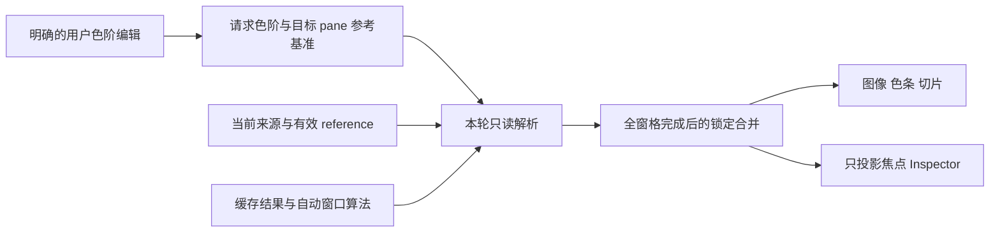

# 时频与阶次手动色阶状态修复 Spec

日期：2026-10-08

状态：已获实施授权并完成主体实现；精确验收范围见[执行记录](../verify/2026-10-08-heatmap-manual-color-scale-state-verification.md)。

执行计划：[Plan](../plans/2026-10-08-heatmap-manual-color-scale-state-plan.md)

检查基线：HEAD `875221db`，含既有未提交修改；实施前重新核对 owner 文件。

## 1. 目标与成功标准

修复时频图（`fft_time`）和时间–阶次图（`order`）在手动 dB 色阶下切换 View 时的累积漂移，同时关闭同源的多窗格串写、切片轴跟随错误色阶、参数捕获和项目保存污染。

必须同时满足：

1. 不改变用户意图、来源及有效参考值时，重复渲染、View 往返、section 往返、焦点切换及项目往返均保持同一色阶。
2. 同一来源的有效 dB 参考值真正变化时，手动色阶仍按物理含义平移，但每次显示从稳定基准推导，不把上一次显示值再次用作输入。
3. 每个窗格的绘制结果与窗格绘制顺序无关；非焦点窗格不能覆盖共享 Inspector。
4. 图像、色条、切片幅值轴及焦点 Inspector 使用同一次解析结果。DSP 数组不修改、不裁剪，计算缓存不因色阶变化失效。
5. 当前与旧项目、既有预设、图表选项及锁定色阶都具有明确兼容行为。

本 Spec 补充并细化 [dB reference Spec §8.3–8.4](2026-07-12-db-reference-defaults-and-labeling-spec.md)：保留合法参考值变更引起的平移，明确其作用对象是同一用户色阶意图及来源，而非复用画布的上一帧。历史 Spec 不回写成已修复记录。

## 2. 现有证据与问题分级

### D1 / P1：跨 View 的错误平移与持久化

已用真实 MainWindow、实际 Qt 组件、合成缓存结果和隔离 QSettings 的 offscreen 探针复现；不是用户原始项目的前台验收。

初始 A、B 都设手动色阶 `[-80, 0]`，dB reference 分别为 `1` 和 `10**1.5`，经正式 `_on_analysis_switch()` 切换：

| 时点 | A 显示色阶 | B 显示色阶 |
| --- | --- | --- |
| 初始 | `[-80, 0]` | 尚未显示，保存值 `[-80, 0]` |
| 第一次 B → A | `[-50, 30]` | `[-110, -30]` |
| 第二次 B → A | `[-20, 60]` | `[-140, -60]` |
| 第三次 B → A | `[10, 90]` | `[-170, -90]` |

时频和阶次均复现。每次返回同一 View，其显示矩阵逐元素相同，色阶和 Inspector 却继续漂移。来源元数据 Auto 解析出不同 reference 时也复现，故“手动色阶”不能与“手动 dB reference”混为一谈。30 dB 是探针参考值比值产生的差，不是产品固定步长。

现有调用链（`ui/` 相对 `mf4_analyzer/`；省略目录的 mixin 文件相对 `mf4_analyzer/ui/main_window/`）：

| 责任 | 当前位置与符号 |
| --- | --- |
| 切换前捕获、目标参数恢复 | `ui/main_window/_analysis_mixin.py`：`_on_analysis_switch`、`_capture_active_analysis_view`、`_on_analysis_view_switched` |
| 取画布旧 reference | `ui/main_window/_state_holders.py`：`canvas_previous_db_reference` |
| 时频错误平移 | `ui/pg_canvas/heatmap_canvas.py`：`reference_delta_since_last_render`、`plot_result` |
| 阶次错误平移 | `ui/main_window/_order_mixin.py`：`_paint_order_heatmap` |
| 派生色阶回写控件 | `_fft_time_mixin.py`：`_paint_fft_time_heatmap`；`_order_mixin.py`：`_paint_order_heatmap` |
| 控件回收进 View | `ui/analysis_view_bridge.py`：`capture_params_to_state` |
| 保存污染传播 | `_project_io_mixin.py`：保存前 capture、`_analysis_views_payload` |

问题并非 `blockSignals` 不生效：它只能抑制即时信号，无法阻止下一次主动 capture 读取被改写的数字。

### D2 / P1：同一 View 的双窗格串写

两个窗格都使用相同来源和 reference，关闭色阶锁定，切入 B 后第一个窗格为 `[-110,-30]`，第二个为 `[-140,-60]`。第一个窗格回写 Inspector，第二个窗格重新从 Inspector 取参，造成同一轮两次平移。

入口为 `window.py:_render_cached_heatmap` 和 `_order_mixin.py:_render_order_on`；`_analysis_mixin.py:_analysis_canvas_updates_controls` 在没有 comparison binding 时直接允许回写，未区分普通双窗格的焦点。

### D3：已确认传播与待验证影响

| 范围 | 当前证据 | 本次处理 |
| --- | --- | --- |
| 切片幅值 Y 轴 | 探针确认跟随错误手动色阶 | 必须同源修复 |
| View.params | 探针确认保存了派生偏移值 | 必须阻断非用户回写 |
| 项目 JSON | 源码确认 capture/序列化传播路径 | 补真实临时项目 round-trip |
| 图像导出、UltraView | 抓取现有画面，传播风险来自源码 | 补产物验证，不另建数值算法 |
| 相同 reference、自动色阶、纯 Linear | 对照探针无累积漂移 | 保留非回归 |
| 固定两 View 并排对比、只切焦点 | 两侧画布及 Inspector 探针无漂移 | 保留对照；增加换配对及重绑定 |
| 时域、FFT、FRF、Batch | 未发现相同的画布历史参考差值调用 | 只跑接缝非回归，不扩展成其他分析重构 |

临时原始记录位于 `.state/manual-level-diagnosis/`。本节已经给出可独立重建的复现条件；正式测试不得依赖该目录或客户文件。此前“8 passed”等输出只说明观察探针和矩阵不变断言通过，不表示色阶恢复合同通过。

## 3. 范围与非目标

实施包含色阶意图/参考基准、热图 render 输入、Inspector 投影与捕获、普通 split/跨 View comparison、图表选项/色条/预设入口、项目兼容及直接导出边界。

不改 FFT/STFT/COT 数学、采样率、时间轴、单位解析规则、计算缓存 key、色图外观、自动色阶分位数算法、主图 X/Y viewport 合同；不新增色阶操作按钮；不修改时域/FFT/FRF 的状态模型；不重写 Batch 渲染；不进行版本发布或广泛 MainWindow 拆分。

原有 `View.params.z_*` 与 `PaneState.chart_appearances['heatmap'].z_*` 继续承担各自已有的默认/覆盖角色。本次不把全部色阶设置迁成一种新的窗格编辑产品，也不另造第二套有效色阶持久化账本。

§6 的冲突覆盖处理和 §7 的“解除锁定恢复自身窗口”是本方案明确提出的行为合同，不宣称当前所有入口已经如此工作。它们需要行为测试及 hints/quickref 的对应说明；实施不得把这部分当成无用户影响的内部改名。

## 4. 核心设计：请求值与显示值分离

### 4.1 定义

- **请求色阶**：用户明确输入或预设明确提供的 `z_auto / lo / hi`，归属 View 默认或 pane 图表覆盖。
- **参考基准**：该请求在特定 pane/source 上成立时的幅值模式、reference 数值和物理上下文；与请求一起解释用户意图。
- **有效色阶**：给定请求、参考基准、当前 reference 和数据后，本轮绘图使用的结果。
- **投影**：将有效色阶显示到画布、色条、切片、Inspector；投影不构成新请求。

对手动 dB 色阶及同一合法物理上下文：

```text
delta = 20 * (log10(reference_at_request) - log10(current_reference))
effective_lo = requested_lo + delta
effective_hi = requested_hi + delta
```

优先使用对数之差，避免正有限 reference 的比值先发生上溢/下溢。不复制谱幅值转 dB 的算法；公式只处理显示窗口。

例：请求 `[-80,0]` 在 reference=1 成立，当前 reference=10 时显示 `[-100,-20]`；再画十次仍为 `[-100,-20]`；回到 reference=1 恢复 `[-80,0]`。A/B 各有自己的基准，不能借用另一 View 的 reference。



### 4.2 权威状态与优先级

| 状态 | 唯一拥有者 | 可写入口 |
| --- | --- | --- |
| View 默认请求色阶 | `AnalysisViewState.params` 现有 `z_auto/z_floor/z_ceiling` | 明确的 View 色阶编辑、含 Z 的预设提交、旧项目迁移 |
| pane 显式请求覆盖 | `PaneState.chart_appearances['heatmap']` 现有 `z_auto/z_min/z_max` | 图表选项等 pane 定向编辑 |
| pane 请求参考基准 | `PaneState` 新增可选 `heatmap_color_basis` | 同一色阶事务建立/重建；读取旧项目时一次补齐 |
| 当前有效色阶及自动窗口 | 本轮不可变 render 输入/结果 | 纯解析；不作为下一轮请求 |
| 显示缓存、投影精度、画布绑定 | `AnalysisContext` 拥有的色阶协调器与现有 canvas/reveal owner | 初始化、投影、失效/销毁；不序列化 |

采用优先级：有效 pane Z 覆盖 → View 默认请求 → section 既有默认值。只改标题、颜色、网格的 pane appearance 不产生 Z 覆盖。不允许先画 View 默认色阶，再被旧 pane Z 覆盖第二次覆盖；先解析一个最终色阶再画。

同一源重复计算、更改时间窗/NFFT/显示尺寸，不重建参考基准。reference 的解析来源文字从 metadata 变为 catalog，但数值、单位、quantity 不变，也不导致色阶变化。

### 4.3 参考基准数据合同

建议以一个 Qt-free 可验证记录表示，序列化字段固定如下；类名可沿用项目风格：

```json
{
  "version": 1,
  "policy_owner": "view_default",
  "source": ["fid", "channel"],
  "amplitude_mode": "amplitude_db",
  "reference": 1.0,
  "unit": "N",
  "quantity": "force"
}
```

`policy_owner` 为 `view_default | pane_override`。pane 所属 section/View/索引由父级提供，不把 `view_id` 再复制进持久化字段。`source` 必须使用完整复合身份，禁止显示名称或单 channel label。unit/quantity 使用现有 resolver 的规范化值，不建立第二个单位目录。

基准不存 effective 色阶、画布地址、矩阵、catalog revision、worker token 或 `_last_db_reference`。它是请求色阶的可重放物理含义，属于用户意图，不是上一次渲染缓存。

以下任一情况，基准不能用于差值运算：缺失/非法 reference；请求权威从 View 默认切到 pane 覆盖或反之；来源复合身份不同；幅值模式不同；单位或 quantity 不兼容；reference 解析明确失败并正在 fallback。

处理规则：保留已保存请求数字，不猜测单位换算，不拿别的 pane/canvas 补基准。对新来源或新请求，用该目标当前成功解析的 reference 重新锚定，首帧 delta=0；解析未成功则基准保持未绑定，沿用现有可见 fallback/诊断，不能把 fallback 当成真实历史。重新绑定只发生一次，不应每帧产生日志。

对同一来源仅 reference 数值变化，保持原基准，直接按公式推导；不得把当前 reference 和 effective 色阶一起反复写成新的请求。

### 4.4 数值边界

- reference 必须为正有限标量，拒绝 bool、零、负数、NaN、Inf；范围必须为两个有限标量且 lo < hi。
- 纯策略层只接收标量及元数据；矩阵消费者仍遵守原 float32/float64、二维形状与时间/频率坐标对齐合同，不广播、不截断、不使用 `min(len(x),len(y))` 掩盖错误。
- 空数据、短数据、全非有限数据不建立伪基准或假自动窗口。无结果时显示既有 empty hint；全非有限矩阵保留既有占位逻辑，不能把占位 `[0,1]` 捕获成手动意图。
- 合法范围内部保留原 double 精度。Inspector 两位显示精度不能反向量化未编辑值；用户只编辑一个边界时，另一边界保留本轮有效值的原始精度，再作为完整新请求提交。
- reference 推导出的合法范围越过现有 spin 的 `[-500,500]` 时不得静默截断。局部投影需容纳该值或提供不损失值的既有显示方式；如需扩大该控件范围，只作用于热图色阶，不改全局 spin helper。
- 平移结果非有限或因浮点精度使有效 lo >= hi 时，拒绝发布新色阶；只能保留同一目标的最后合法画面，否则显示既有可操作空态/错误反馈，不能留下其他 View 的旧图冒充当前结果。记录可定位诊断，不写回污染请求。

## 5. 一次渲染事务

引入窄职责色阶协调器，由现有 `AnalysisContext` 显式创建和拥有。协调器接收明确的 state、pane、source、reference、编辑来源，不通过隐式“当前控件”识别数据归属。禁止新增多个 mixin 共享写入的 MainWindow 字段。

事务顺序：

1. 解析目标 `(section, view_id, pane_index, source)` 和所有 pane 的请求快照，校验绑定仍存在。
2. 在组事务内逐 pane 从所属 View/pane 请求解析 reference 和有效色阶，绘制输入冻结后使用；所有 pane 完成前禁止投影 Inspector。请求始终读所属状态而非其他 pane 的控件输出，因此不要求同时持有所有大矩阵。
3. 冻结输入，绘制数据矩阵和最终色阶；无有效数据的 pane 不贡献自动窗口。
4. 所有 pane 画好后，执行一次锁定组的最终范围合并/传播，再同步色条与切片幅值范围。
5. 仅向当前可见 section 的实际焦点目标投影一次最终结果；背景完成、非焦点 pane、comparison 另一侧不改控件。
6. 在最终色阶/锁定/布局稳定后提交现有 reveal signature 和 presentation ready；导出和 UltraView 读取这个最终状态。

同一事务不得把控件写回作为下一 pane 的输入。渲染失败或目标已删除不能提交半套基准/请求；下一次恢复可重试。失效目标不回写新焦点。

`_last_db_reference` 可在兼容接口中保留，但正式 MainWindow 路径不再据其计算用户色阶。`FftTimeHeatmapRenderInputs`、`OrderHeatmapRenderInputs` 与 `heatmap_level_writeback_blocks_retain` / `finish_heatmap_render_inputs` 必须同步调整：相同 owning intent、result 和有效参考重复进入可以保留画面；真正参考变化必须重画，但不提交 DSP。

画布提供显式“最终 levels 已解析”入口或等价参数，避免主窗口已解析后 `plot_result` 再平移。保留已有公共 import 和裸 canvas 默认调用行为；旧的单画布合法参考值切换测试继续有效。两种调用必须显式隔离，不能用“调用两次参考差值让第二次为零”规避。

## 6. 编辑、投影与捕获合同

### 6.1 入口与作用域

| 事件 | 请求/基准行为 | 重绘/控件行为 |
| --- | --- | --- |
| 普通 View/section/焦点切换、重绘、缓存命中 | 保留已有请求与有效基准 | 从目标状态计算，投影不发布用户编辑 |
| Inspector 明确编辑 Z | 更新目标 View 默认请求；清除焦点 pane 冲突的 Z 覆盖；对所有跟随该默认值的 pane 以各自当前 reference 重建基准 | 保留其他 pane 的显式 Z 覆盖；未锁定不扩大覆盖范围 |
| 色条拖动、色条双击恢复 | 提交交互发起目标的有效窗口；若该 pane 有覆盖则更新覆盖，否则更新其 View 默认；按同一作用域重建基准 | 连续拖动保持 1:1；结束后提交持久状态；遵守既有拖动不重置 handle 原点合同 |
| 图表选项 Apply / 还原 | 更新目标 pane Z 覆盖和基准；仅更改标题/色图不触碰 Z | 还原恢复打开时请求及基准快照；构造/取消不提交 |
| 显式切自动色阶 | 清除该请求作用域内手动基准 | 自动算法继续基于数据，不用手动上下限作偏移 |
| 自动 → 手动 | 将当前最终可见窗口作为新请求，并以当前 reference 锚定 | 不跳变；锁定时取锁定后的共同窗口 |
| dB ↔ Linear | 保持现有切单位时自动色阶/默认值规则，清理旧 dB 基准 | Linear 不做 dB delta；不能继承另一模式的数字基准 |
| 同源 reference 用户修改 / catalog 改变 | 不改请求范围与原基准 | 重新解析有效值一次；不重算 DSP |
| 换到不同 source | 解除旧基准绑定，用新来源解释原请求数字，首帧不作跨源补偿 | 保留来源选择/计算有效性既有逻辑 |
| 应用含 Z 的 View 预设 | 预设数字作为新请求；清理本 View 各 pane 冲突的 Z 覆盖、重建基准 | 保留非 Z appearance；其他 View 不变 |
| 预设不含 Z / 只改 X/Y/色图/标题 | 保留 Z 请求和基准 | 不因控件携带完整 params 而隐式提交 Z |

明确的 Z 操作改变受影响请求；单纯因为完整 `current_params()` 里存在 z 字段，不构成 Z 操作。不能通过“新值与旧值是否相等”判断用户意图来源：程序投影和同值用户确认都可能出现。

本表统一现有入口的目标与覆盖优先级，不新增窗格编辑开关。若 Task 0 发现已有明确产品合同与表中范围冲突，先记录实际合同并修订此表和测试映射，禁止以实现方便扩大到所有窗格。

### 6.2 Inspector 精度与 params 捕获

`current_params()` / `get_params()` 既有外部接口保持可用。正式 View capture、非 Z display edit、compute edit、保存、预设比较必须通过拥有者合并请求：保留已拥有的原始 z 字段，不能将有效显示数字从控件灌回请求。

在完整 apply/restore guard 之外还要区分用户编辑来源。修改 `capture_params_to_state` 的热图接入时，FFT/FRF 与旧 duck-typed 调用保持原语义；不要让通用 bridge 导入 MainWindow。上下文可提供明确的持久化请求快照能力，通用 bridge 使用显式接口并保留旧 fallback。

纯参考值投影、焦点切换、重画不能让预设因派生 z 数字变化而显示“用户已修改”；预设 baseline 比较使用请求值。用户明确把当前可见色阶保存为新预设时，则导出当前有效数字作为可复用新请求，不把 pane/source 基准写入公共预设。

Z 编辑事件必须携带或在入口固定目标身份与精确边界。异步回调不能到执行时再读取新的焦点作为 owner。

## 7. Split、Comparison 与锁定色阶

普通 split 的两个 pane 都必须有明确 owner，即使没有 comparison binding。焦点判断必须同时覆盖普通 split 与 comparison，不得在“未绑定 comparison”分支无条件返回允许回写。

未锁定时，各 pane 按自己的请求优先级、source 和 reference 求值；反转绘制顺序，画面及焦点控件结果相同。

锁定时沿用既有“合并有效窗口”的策略，合并范围为参与 pane 有效窗口的 `min(lo), max(hi)`，不更改自动分位数策略。必须等所有参与 pane 的本轮窗口已准备好才合并；禁止将旧 View 的残留画布作为输入，禁止每画一个 pane 重新把中间合并结果写回参数。

锁定共同范围属于呈现覆盖，不用它反向改写各 pane 的请求。锁定状态仍由既有 `state.compare` 或 comparison relation 保存，不在新基准内复制。解除锁定后显示各自拥有者解析出的窗口；不把锁定期间的派生 union 当成新的手动意图。此处明确消除旧画布残留范围对恢复结果的影响，不增加新的锁定算法。

锁定状态下发生真实手动色阶编辑时，在一个事务中把共同数字提交到参与成员各自请求作用域并分别锚定当前 reference；所有成员色条、图像、手动切片轴一致。程序化传播不再次触发用户提交。自动策略的锁定共同窗口仍为派生结果。

跨 View comparison 保留 `_comparison_levels_compatible` 既有 amplitude mode、weighting、quantity/unit/reference 兼容约束；不因数值看似接近绕过它。换配对、互换 host/peer、增加/移除 pane、退出对比与删除 View 都不得把画布历史迁给新的 owner。

## 8. 项目、迁移和生命周期

### 8.1 新项目

`PaneState.heatmap_color_basis` 是可选持久字段；`to_dict/from_dict` 深拷贝、验证，并随 file-id remap 更新 `source[0]`。本次实施基线 nested schema 为 11，新增可选字段后已提升为 12。本任务不改 `APP_VERSION` 或外层项目格式，除非现有加载器证据要求另行修订设计。

仅热图拥有者建立该字段；无基准时省略，不能给 FFT/FRF pane 填充热图默认记录。

保存仅序列化请求与基准；不保存有效色阶或 canvas 历史。重开且物理解析相同，显示完全恢复；重开时 catalog 对同一来源提供新 reference，按保存基准产生一次确定性投影。首次迁移补基准在 restore 事务内完成，不制造“用户改动”的 dirty 状态；用户主动保存时再落盘。

### 8.2 旧项目和不完整数据

- 缺少基准：以旧 pane 覆盖优先、否则 View 请求的原数字为准；第一次成功解析目标来源时建立基准，首帧不平移。
- 已被旧 bug 污染的数字：保持保存值，不猜测用户切换次数，不自动减 30/60/120 dB，不宣称能恢复用户原始设置。
- 基准内容损坏：只丢弃非法基准，保留合法请求及其他 pane 内容，使用既有日志记录一次；不能整个项目加载失败或静默吞编程错误。
- 来源缺失/文件重映射失败：保留合法请求、清理失配基准，维持既有 missing-source UI；不能从另一个同名通道借 reference。
- public preset、Batch recipe 不引入此 pane 字段。GUI “当前参数”转 Batch/用户预设的桥接须在明确导出时展开当前有效值，否则把未展开的请求数字交给无基准的 Batch 会产生新偏差。
- 旧版程序是否忽略新字段需要实际验证；不承诺旧程序能恢复新基准语义。新程序必须读取旧项目。

### 8.3 生命周期

| 事件 | 基准处理 |
| --- | --- |
| 新 View | 无基准，沿用默认/空来源 |
| 复制 View | 深拷贝请求、pane 基准；新 View 身份独立，运行时绑定不复制 |
| 新增 pane | 从现有 View 默认/复制意图建立自己的来源基准，不复制另一来源的物理历史 |
| 删除 pane/View、项目关闭 | 清除协调器投影缓存、绑定和待提交记录，停止相关回调 |
| canvas clear / cache miss | 只清画布表现与运行缓存；源未变时保留已成立的用户基准 |
| 同源重新计算 | 保留手动请求基准；自动窗口按新结果重算 |
| source 更换/移除 | 失配基准按 §4.3 解除，不能保留为下一来源的历史 |

## 9. 导出与其他分析边界

`grab_pixmap`、复制图像及 UltraView 应在最终事务提交后抓取；不得通过额外 source View 切换/渲染修改请求。展示相同内容时，导出前后请求/基准、焦点及有效 levels 不变。

Batch 渲染目前直接使用输入色阶，不使用画布历史差值，继续保持此边界。GUI 向 Batch 提供已展开的有效显示窗口；原生 Batch recipe 数字语义不变。CSV/数值输出和 DSP 缓存数组不受色阶或基准字段影响。

时域、FFT、FRF 只验证共享 capture/参数桥接没有回归。尤其 FRF dB 是传递比，不引入绝对 reference 补偿。

## 10. 验收矩阵

所有核心用例用自包含合成数据；`fft_time` 与 `order` 参数化。重复至少 20 个完整往返，同时在初始、首轮和末轮比较 owner payload、有效值、控件与数组。范围 double 比较采用能解释的浮点容差，控件两位显示只验证显示舍入，不以该舍入放宽 owner 精度断言。

最小恢复 fixture 可用 8 个时间点 `linspace(0,0.5,8)`、16 个频率点 `linspace(0,200,16)` 或阶次点 `linspace(0,10,16)`。时频 amplitude shape 为 `(16,8)`，阶次为 `(8,16)`；各放一个不同位置的峰值以识别串图，另参数化 float32/float64。元数据来源测试必须有两个不同 fid 和同名通道；实际计算端到端 fixture 单独生成带已知频率的信号和合法正 RPM，不把合成矩阵当成实际 DSP 结果验收。

| ID | 场景与硬性断言 | Gate |
| --- | --- | --- |
| A01 | 两个已计算 View，manual Z，reference=1 与 10**1.5；来回 20 轮各自仍为初始窗口，owner 数字不变、零新计算 | 集成失败先行 |
| A02 | Auto reference，不同来源/同名通道、元数据解析比值不同；同 A01 | 来源隔离 |
| A03 | 每 View 两 pane，锁定关闭，焦点 0/1、正/逆绘制顺序；无第二次 delta、无非焦点串写 | split |
| A04 | 同源 reference 1→10→1、catalog 可见/隐藏更新；显示 -20 dB 再恢复，重复渲染无再平移，cache 不失效 | 数学与集成 |
| A05 | same reference、自动 Z、Linear、空白 View、cache miss/补结果、section 往返 | 对照 |
| A06 | 色条连续拖动/结束/双击、Inspector 单边编辑、图表 Apply/还原/取消、auto↔manual、dB↔Linear | 交互入口 |
| A07 | View 默认与 pane Z 覆盖冲突、仅标题/cmap 覆盖、含/不含 Z 预设；优先级及作用域符合 §6 | 请求拥有权 |
| A08 | 锁定开/关、manual/auto、部分 pane 无结果、参考值变更；最终 union 一次，图像/色条/手动切片一致 | 组事务 |
| A09 | comparison host/peer 各 1/2 pane；切焦点、换配对、删 View、退出及非焦点后台完成；目标和兼容约束不丢 | 路由 |
| A10 | 新项目保存重开、旧无基准/损坏基准、fid remap/缺源、View 复制；原精度保留，无错误归属 | 持久化 |
| A11 | +/−30、120 dB、超出控件旧范围、极小/极大合法 reference、非法 reference/范围/空矩阵；无静默 clamp | 边界 |
| A12 | 相同 source/reference 下 20 轮数组逐元素不变、dtype/shape/时间轴不变；改变 ref 只改显示矩阵，raw 不变 | 数值隔离 |
| A13 | 保存、只改 X/Y/颜色、切焦点、重画不把有效值变请求；预设 baseline 不因投影漂移 | 捕获 |
| A14 | CSV/Batch 当前参数桥接、PNG/复制/UltraView；effective levels 一致，操作前后 owner 不变 | 产物 |
| A15 | reveal/retain 重用正确，参考改变重画一次、unchanged entry 不多画；独立画布旧 API 合同保留 | 生命周期/兼容 |
| A16 | 共享 bridge 下 FFT/FRF/time 原有行为与 import/state/signal ratchet | 边界非回归 |
| A17 | 实际 Cocoa/前台 TraceLab：两 View 反复切换、split、色条和切片轴、拖动、保存重开 | 原生前台 |
| A18 | 新鲜 Windows Full/Lite frozen 包重复 A17 核心路径 | 跨平台发布验收 |

## 11. 完成定义与证据分层

文档完成：Spec/Plan 全文一致、路径与现有符号核实、拟新增文件明确、任务–验收–测试可追溯、`git diff --check` 通过。初始文档阶段无可执行修改；实施阶段结果另列执行记录。

实现完成：A01–A16 所有适用门禁有实际结果；所有新失败必须归因处理，不能以观察脚本的 passed 或旧测试绿色代替新合同。

原生验收：A17 单列 Cocoa 探针与前台交互证据；合成 fixture 与用户原始项目分开记录。原始项目不可用时，明确该复核未完成，但不得因此省略可执行的合成前台验证。A18 为 Windows 发布门禁，不得用 source/offscreen 检查冒充。

报告逐项使用 PASS / FAIL / UNVERIFIED / 不适用及理由。不需要通用全量 suite baseline；按 Plan 的 focused owner 和边界 gate 执行。若范围实际扩成跨模块重构或发布验收，再记录理由、指定单一 full-gate owner、稳定 HEAD/dirty fingerprint，遵守主套件与 acquisition_ui 顺序分进程。
